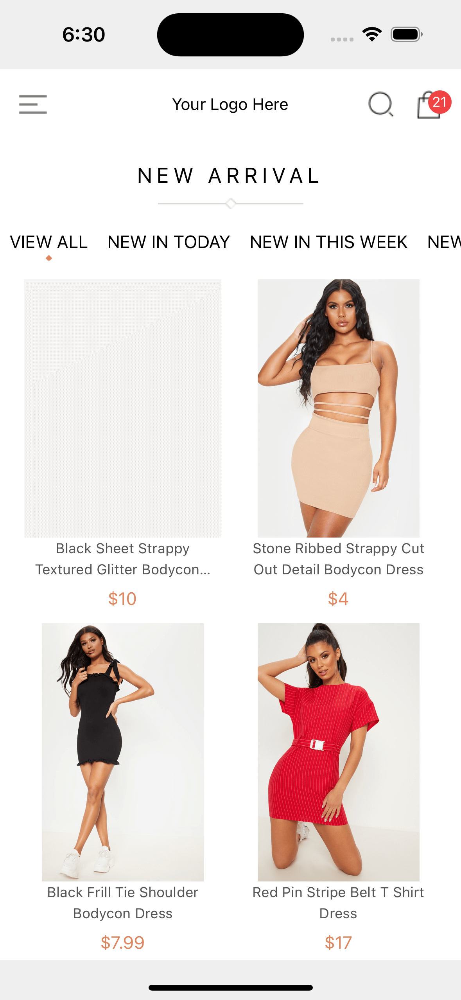
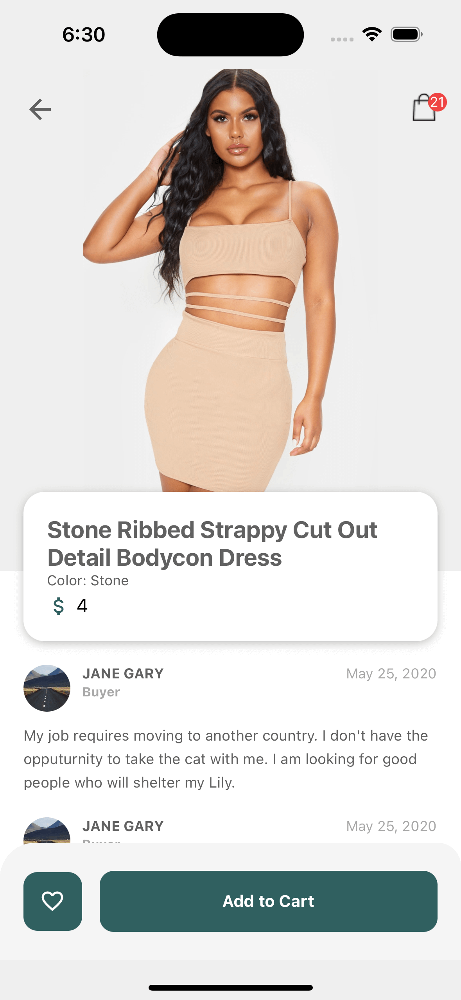
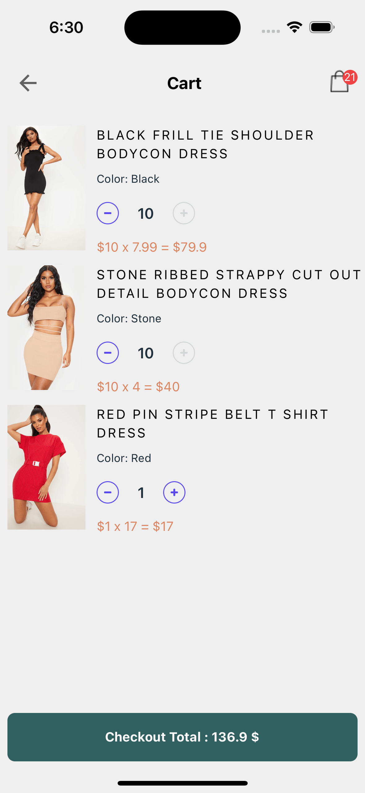

# eccomerce-assisment

## run just for testing

### Note

This application is based on Component First Approach That mean unit test will be Created in the level of Component.you can Find the Test file in every Component in Component Folder. Thanks

## Note 2

Add Screen Test to The HomeScreen To Test RTK Query With mock Data. `yarn test HomeScreen`

to Run Test just type `yarn test`

# there are total of 5 test cases in the application.

1. Is the App is Booting Right `yarn test App`
2. All the Branding is in Place. like styling and Gaps `yarn test Brand`
3. Cart Test for Mock Test of Redux `yarn test Cart`
4. Custom Drawer Content Test for Testing mock of Native navigation and Drawer Navigation `yarn test CustomDrawerContent`
5. Header Text to check if Header is render in All Screen `yarn test Header`
6. Added Test For Redux Including redux-thunk For Add Quantity And Decrease Quantity.

## App Contain 3 screen

Home, ProductDetail and Cart Screen

## using React Redux Toolkit for State management

## using RTK Query For Api Data Getting.

## Screen Shot of application could be found in Preview folder

| Home                           | DetailPage                     | Cart Page                      |
| ------------------------------ | ------------------------------ | ------------------------------ |
|  |  |  |
